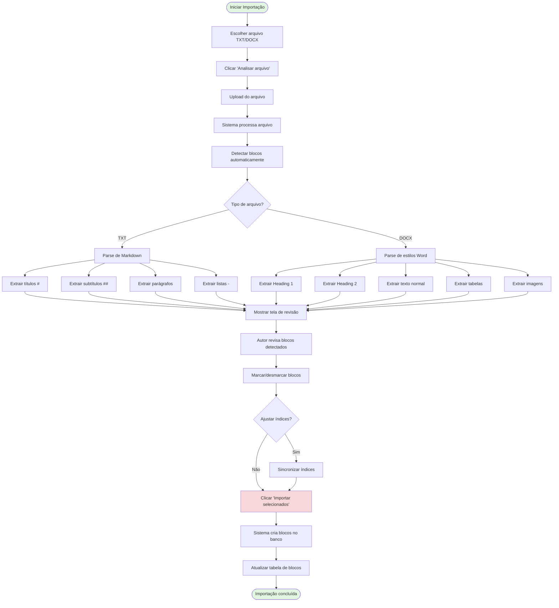
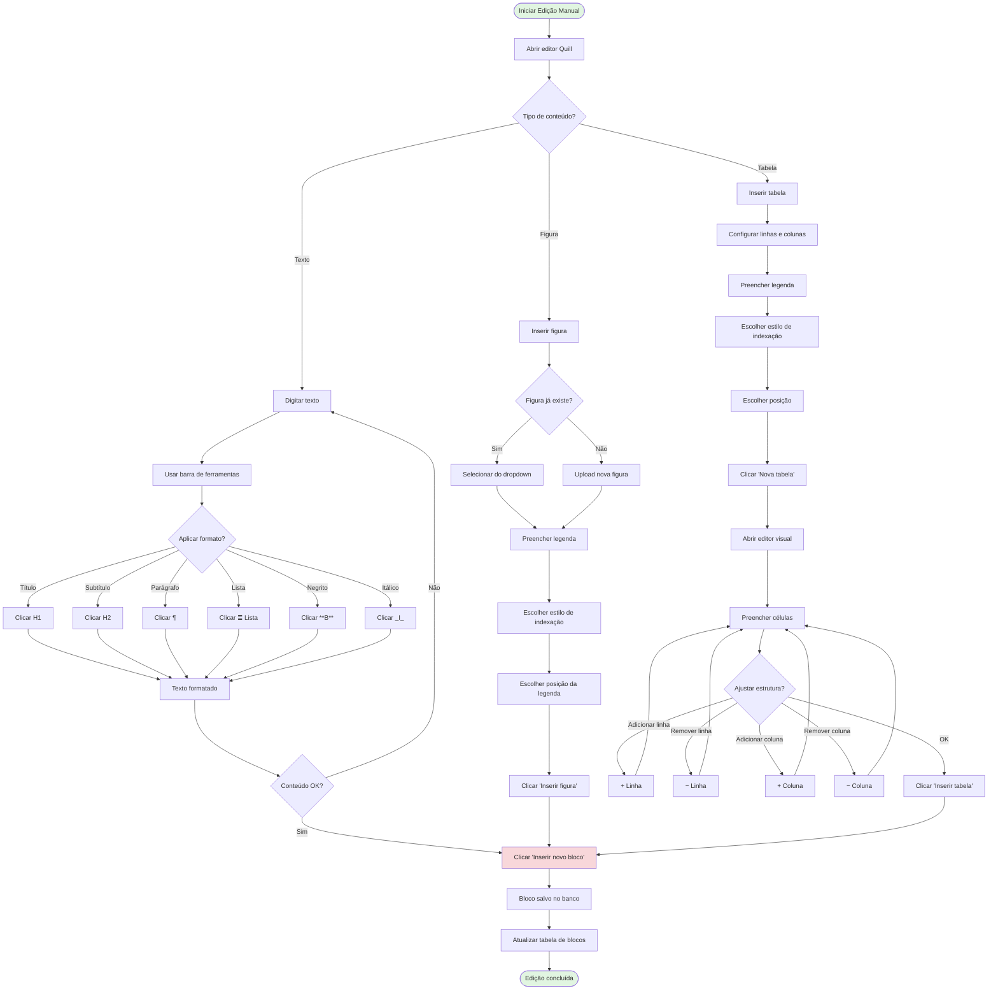
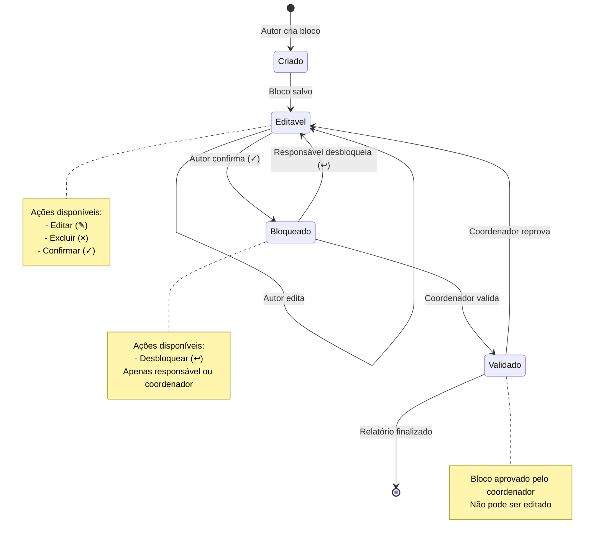
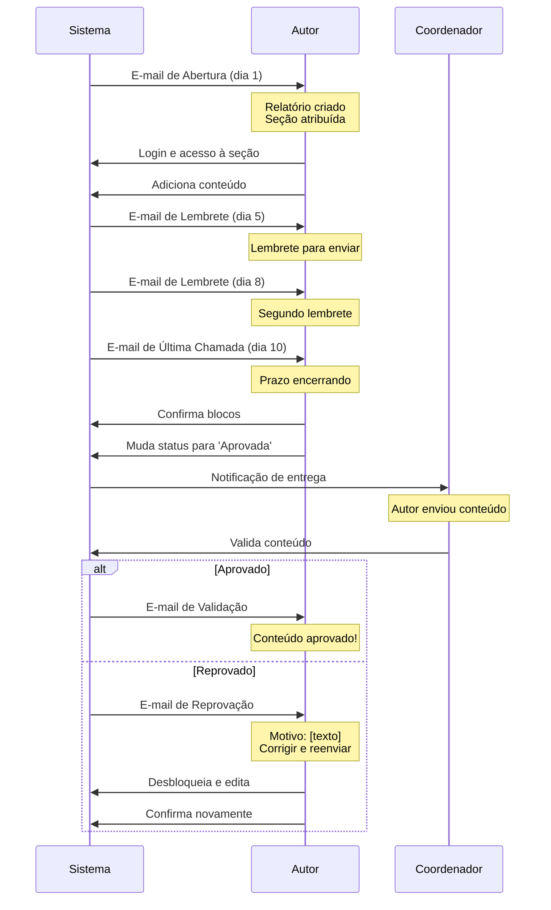

# Fluxo do Autor — Diagrama Visual

Este documento contém diagramas visuais do fluxo de trabalho do autor no sistema SRA.

## 1. Fluxo Completo (Visão Geral)

```mermaid
flowchart TD
    Start([Autor recebe e-mail]) --> Login[Login no sistema]
    Login --> Dashboard[Acessar Dashboard]
    Dashboard --> Sumario[Visualizar Sumário do Relatório]
    Sumario --> VerificarSecao{Seção atribuída?}
    
    VerificarSecao -->|Não| Aguardar[Aguardar atribuição do coordenador]
    Aguardar --> Sumario
    
    VerificarSecao -->|Sim| AbrirEditor[Abrir Editor da Seção]
    AbrirEditor --> ConfirmarCoord[Confirmar Responsável e Status]
    ConfirmarCoord --> EscolherMetodo{Escolher método de entrada}
    
    EscolherMetodo -->|Importar| ImportarArquivo[Importar TXT/DOCX]
    EscolherMetodo -->|Manual| DigitarManual[Digitar no Editor]
    
    ImportarArquivo --> AnalisarArquivo[Sistema analisa e detecta blocos]
    AnalisarArquivo --> RevisarBlocos[Revisar blocos detectados]
    RevisarBlocos --> SelecionarBlocos[Selecionar blocos para importar]
    SelecionarBlocos --> ImportarConfirmar[Confirmar importação]
    ImportarConfirmar --> VerBlocos[Ver blocos na tabela]
    
    DigitarManual --> UsarEditor[Usar editor Quill]
    UsarEditor --> AdicionarFiguras{Adicionar figuras/tabelas?}
    AdicionarFiguras -->|Sim| InserirMidia[Inserir figuras/tabelas]
    AdicionarFiguras -->|Não| SalvarBloco[Inserir novo bloco]
    InserirMidia --> SalvarBloco
    SalvarBloco --> VerBlocos
    
    VerBlocos --> EditarNecessario{Precisa editar?}
    EditarNecessario -->|Sim| EditarBloco[Editar bloco existente]
    EditarBloco --> VerBlocos
    
    EditarNecessario -->|Não| VerificarPreview[Verificar pré-visualização]
    VerificarPreview --> PreviewOK{Preview OK?}
    PreviewOK -->|Não| EditarBloco
    
    PreviewOK -->|Sim| ConfirmarBlocos[Confirmar blocos selecionados]
    ConfirmarBlocos --> BlocosConfirmados{Todos confirmados?}
    BlocosConfirmados -->|Não| VerBlocos
    
    BlocosConfirmados -->|Sim| MudarStatus[Mudar status para 'Aprovada']
    MudarStatus --> AguardarValidacao[Aguardar validação do coordenador]
    AguardarValidacao --> ReceberNotif[Receber notificação por e-mail]
    ReceberNotif --> Validado{Validado?}
    
    Validado -->|Sim| Concluido([Concluído!])
    Validado -->|Não| VerMotivo[Ver motivo da reprovação]
    VerMotivo --> DesbloquearBlocos[Desbloquear blocos]
    DesbloquearBlocos --> EditarBloco
    
    style Start fill:#e1f5e1
    style Concluido fill:#e1f5e1
    style Login fill:#fff3cd
    style ConfirmarBlocos fill:#f8d7da
    style MudarStatus fill:#f8d7da
```



## 2. Fluxo de Importação de Conteúdo



## 3. Fluxo de Edição Manual



## 4. Fluxo de Confirmação de Blocos

```mermaid
flowchart TD
    Start([Blocos criados]) --> VerTabela[Ver tabela de blocos]
    VerTabela --> EscolherMetodo{Método de confirmação?}
    
    EscolherMetodo -->|Individual| SelecionarUm[Selecionar um bloco]
    EscolherMetodo -->|Lote| SelecionarVarios[Selecionar múltiplos blocos]
    
    SelecionarUm --> ClicarCheck[Clicar ✓ (Confirmar)]
    ClicarCheck --> BlocoConfirmado[Bloco bloqueado]
    BlocoConfirmado --> MaisParaConfirmar{Mais blocos?}
    MaisParaConfirmar -->|Sim| SelecionarUm
    MaisParaConfirmar -->|Não| TodosConfirmados
    
    SelecionarVarios --> MarcarCheckboxes[Marcar checkboxes]
    MarcarCheckboxes --> ClicarConfirmarLote[Clicar 'Confirmar' no topo]
    ClicarConfirmarLote --> BlocosConfirmados[Blocos bloqueados em lote]
    BlocosConfirmados --> TodosConfirmados
    
    TodosConfirmados[Todos os blocos confirmados] --> VerificarStatus[Verificar status da seção]
    VerificarStatus --> StatusAtual{Status atual?}
    
    StatusAtual -->|Pendente| MudarParaAndamento[Mudar para 'Em andamento']
    StatusAtual -->|Em andamento| MudarParaAprovada[Mudar para 'Aprovada']
    StatusAtual -->|Aprovada| StatusOK
    
    MudarParaAndamento --> ClicarConfirmarStatus1[Clicar 'Confirmar']
    MudarParaAprovada --> ClicarConfirmarStatus2[Clicar 'Confirmar']
    ClicarConfirmarStatus1 --> StatusOK
    ClicarConfirmarStatus2 --> StatusOK
    
    StatusOK[Status atualizado] --> NotificarSistema[Sistema notifica coordenador]
    NotificarSistema --> AguardarValidacao[Aguardar validação]
    AguardarValidacao --> ReceberEmail[Receber e-mail de validação]
    ReceberEmail --> ResultadoValidacao{Resultado?}
    
    ResultadoValidacao -->|Aprovado| Concluido([Seção concluída!])
    ResultadoValidacao -->|Reprovado| VerMotivo[Ver motivo da reprovação]
    VerMotivo --> DesbloquearBlocos[Desbloquear blocos]
    DesbloquearBlocos --> ClicarDesbloquear[Clicar ↩ (Desbloquear)]
    ClicarDesbloquear --> BlocoDesbloqueado[Bloco editável novamente]
    BlocoDesbloqueado --> EditarBloco[Editar bloco]
    EditarBloco --> ClicarCheck
    
    style Start fill:#e1f5e1
    style Concluido fill:#e1f5e1
    style ClicarConfirmarLote fill:#f8d7da
    style MudarParaAprovada fill:#f8d7da
```

## 5. Estados e Transições dos Blocos



## 6. Ciclo de Notificações



## 7. Arquitetura de Rotas (Referência Técnica)

```mermaid
graph LR
    A[Cliente/Navegador] --> B[FastAPI App]
    
    B --> C[/login]
    B --> D[/dashboard]
    B --> E[/relatorios/:id]
    B --> F[/relatorios/:id/secoes/:id/upload-conteudo]
    
    F --> G[GET: Carregar editor]
    F --> H[POST: Criar bloco]
    F --> I[POST: Confirmar bloco]
    F --> J[POST: Editar bloco]
    F --> K[POST: Excluir bloco]
    
    H --> L[(PostgreSQL)]
    I --> L
    J --> L
    K --> L
    
    F --> M[/preview]
    M --> N[Renderizar HTML A4]
    
    F --> O[/exportar]
    O --> P[Gerar DOCX]
    
    style A fill:#e1f5e1
    style L fill:#d1ecf1
    style N fill:#fff3cd
    style P fill:#fff3cd
```

---

**Versão:** SRA v1.0 (PLI/SP-2050)  
**Última atualização:** Abril/2026

## Como Visualizar os Diagramas

Estes diagramas estão em formato **Mermaid** e podem ser visualizados:

1. **No GitHub:** Automaticamente renderizados ao visualizar este arquivo `.md`
2. **No VS Code:** Instale a extensão "Markdown Preview Mermaid Support"
3. **Online:** Cole o código em https://mermaid.live/
4. **No Cursor:** Suporte nativo para preview de Mermaid em Markdown
